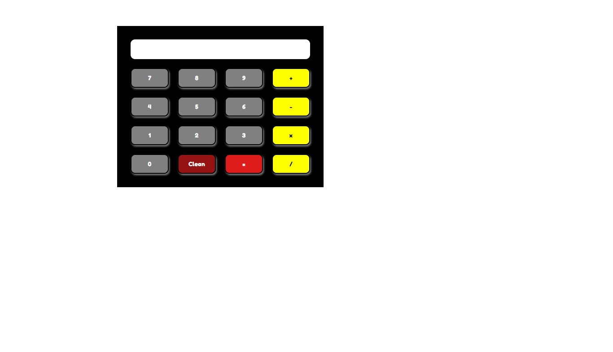

# calculadora

## Visão geral

### O desafio

Esta calculadora deverá realizar operações matemáticas simples, com exposição do número em um display, e os botões deverão mudar de cor ao serem clicados.


### Captura de tela




### Links

- URL da solução: [Calculadora](https://jade-entremet-997fcb.netlify.app)

## Meu processo

### Construído com

- Marcação HTML5 semântica
- Propriedades personalizadas CSS
- Flexbox
- Grade CSS
- Javascript

### O que eu aprendi

Ainda estou em processo de aprendizado. A dinâmica do funcionamento da página ainda não está concluída. 


Para ver como você pode adicionar trechos de código, veja abaixo:


```


function limpar(){
    document.getElementsByClassName('resultado').innerHTML = "";
}

function calc(num1, num2, sinal){
    
    if (sinal==='mais'){
        result = parseint(num1) + parseint(num2);
    } else if (sinal==='menos'){
        result = parseint(num1) - parseint(num2);
    } else if (sinal==='mult'){
        result = parseint(num1) * parseint(num2);        
    } else if (sinal==='div'){
        result = parseint(num1) / parseint(num2);    
    } else{
        result = '0';
        document.getElementsByClassName('resultado').innerHTML = result;
    }
     

```


### Desenvolvimento contínuo

Ainda espero concluir este projeto, porém terei de estudar mais sobre o Javascript.

### Recursos úteis

- [Netlify](https://www.netlify.com) - Isso me ajudou para executar meu projeto. 


## Autor

- Nolyanne


## Agradecimentos

Agradeço à Claudia Antunes por me inspirar a implementar esse projeto, através de um post do Linkedin.
